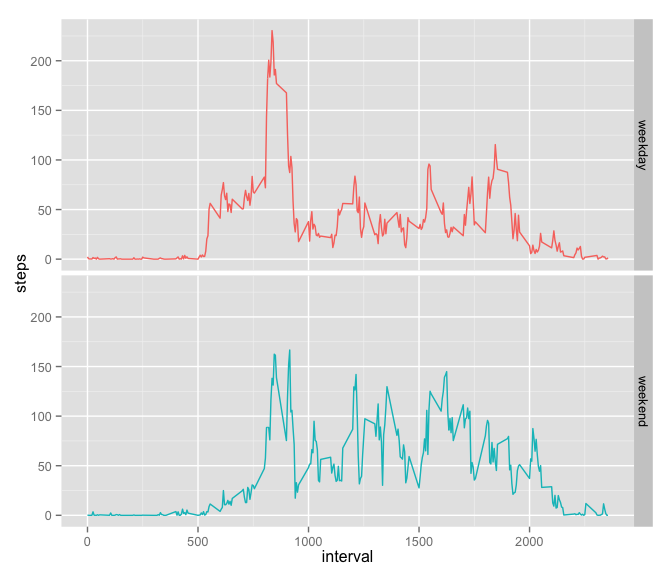

# Reproducible Research: Peer Assessment 1
Federico Calore  
7 Nov 2015  

## Introduction
> Data from a personal activity monitoring device. This device collects data at 5 minute intervals through out the day. The data consists of two months of data from an anonymous individual collected during the months of October and November, 2012 and include the number of steps taken in 5 minute intervals each day.

## Loading and preprocessing the data

### Load the data

After checking existence of the files,
1. download,
2. unzip and
3. load the data in memory


```r
file <-
  "https://d396qusza40orc.cloudfront.net/repdata%2Fdata%2Factivity.zip"
dest <- "repdata_data_activity.zip"
if (!file.exists(dest)) {
  download.file(file, dest, method = "curl")
  today <- as.character(Sys.time())
  print(paste("File downloaded on", today)) # print date and time of download
}
content <- unzip(dest, list = TRUE)
if (!file.exists(content$Name)) {
  unzip(dest)
}
activity <- read.csv(content$Name)
str(activity)
```

```
## 'data.frame':	17568 obs. of  3 variables:
##  $ steps   : int  NA NA NA NA NA NA NA NA NA NA ...
##  $ date    : Factor w/ 61 levels "2012-10-01","2012-10-02",..: 1 1 1 1 1 1 1 1 1 1 ...
##  $ interval: int  0 5 10 15 20 25 30 35 40 45 ...
```

## What is mean total number of steps taken per day?

1. Calculate the total number of steps taken per day and make a histogram.


```r
daily_steps <- data.frame(
  steps = tapply(activity$steps, activity$date, FUN = sum)
)

library(ggplot2)
ggplot(daily_steps, aes(steps)) + geom_histogram()
```

 

2. Calculate and report the mean and median of the total number of steps taken per day.


```r
mean(daily_steps$steps, na.rm = TRUE)
```

```
## [1] 10766.19
```

```r
median(daily_steps$steps, na.rm = TRUE)
```

```
## [1] 10765
```

## What is the average daily activity pattern?

1. Make a time series plot of the 5-minute interval (x-axis) and the average number of steps taken, averaged across all days (y-axis).


```r
mean_steps <- data.frame(
  interval = unique(activity$interval),
  steps = tapply(activity$steps, activity$interval, FUN = mean, na.rm = TRUE)
)
ggplot(mean_steps, aes(x = interval, y = steps)) + geom_line()
```

 

2. Which 5-minute interval, on average across all the days in the dataset, contains the maximum number of steps?


```r
mean_steps[which(mean_steps$steps == max(mean_steps$steps, na.rm = TRUE)), ]
```

```
##     interval    steps
## 835      835 206.1698
```

## Imputing missing values

1. Calculate and report the total number of missing values in the dataset.


```r
NAvalues <- is.na(activity$steps)
sum(NAvalues)
```

```
## [1] 2304
```

2. Devise a strategy for filling in all of the missing values in the dataset. The strategy does not need to be sophisticated. For example, you could use the mean/median for that day, or the mean for that 5-minute interval, etc.
Create a new dataset that is equal to the original dataset but with the missing data filled in.


```r
activity_mean <- merge(activity[, 2:3], mean_steps)
activity_mean <- activity_mean[with(activity_mean, order(date, interval)), ]

activity_fill <- activity
activity_fill$flag <- ifelse(NAvalues, "input", "original")
activity_fill[NAvalues, "steps"] <- activity_mean[NAvalues, "steps"]
```

3. Make a histogram of the total number of steps taken each day.


```r
daily_steps_fill <- data.frame(
  steps = tapply(activity_fill$steps, activity_fill$date, FUN = sum)
)

ggplot(daily_steps_fill, aes(steps)) + geom_histogram()
```

 

4. Calculate and report the mean and median total number of steps taken per day.


```r
mean(daily_steps_fill$steps)
```

```
## [1] 10766.19
```

```r
median(daily_steps_fill$steps)
```

```
## [1] 10766.19
```

5. Do these values differ from the estimates from the first part of the assignment? What is the impact of imputing missing data on the estimates of the total daily number of steps?

???

## Are there differences in activity patterns between weekdays and weekends?

1. Create a new factor variable in the dataset with two levels – “weekday” and “weekend” indicating whether a given date is a weekday or weekend day.


```r
daynames <- c("Monday", "Tuesday", "Wednesday", "Thursday", "Friday")

activity_fill$day <-
  factor(ifelse(weekdays(as.Date(activity_fill$date)) %in% daynames,
                "weekday", "weekend"))
```

2. Make a panel plot containing a time series plot of the 5-minute interval (x-axis) and the average number of steps taken, averaged across all weekday days or weekend days (y-axis).


```r
activity_fill_weekday <- subset(activity_fill, day == "weekday")
mean_steps_weekday <- data.frame(
  day = "weekday",
  interval = unique(activity$interval),
  steps = tapply(activity_fill_weekday$steps, activity_fill_weekday$interval, FUN = mean, na.rm = TRUE)
)

activity_fill_weekend <- subset(activity_fill, day == "weekend")
mean_steps_weekend <- data.frame(
  day = "weekend",
  interval = unique(activity$interval),
  steps = tapply(activity_fill_weekend$steps, activity_fill_weekend$interval, FUN = mean, na.rm = TRUE)
)

mean_steps_days <- rbind(mean_steps_weekday, mean_steps_weekend)

ggplot(mean_steps_days, aes(x = interval, y = steps)) + geom_line() + facet_grid(day ~ .)
```

 
