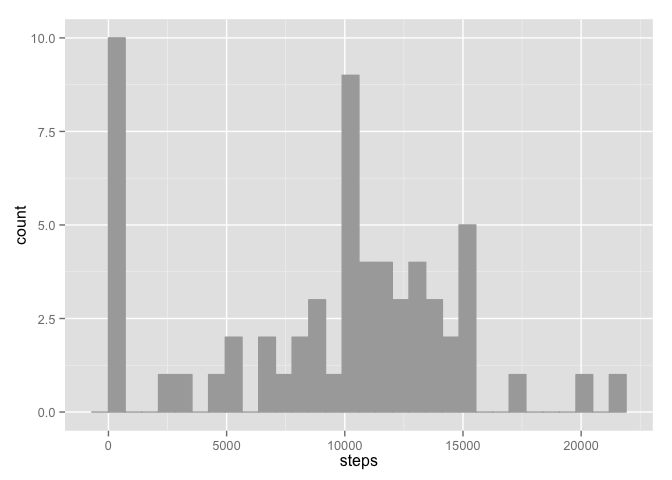
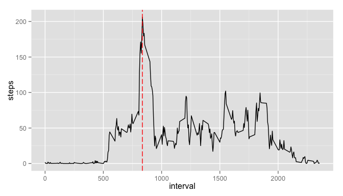
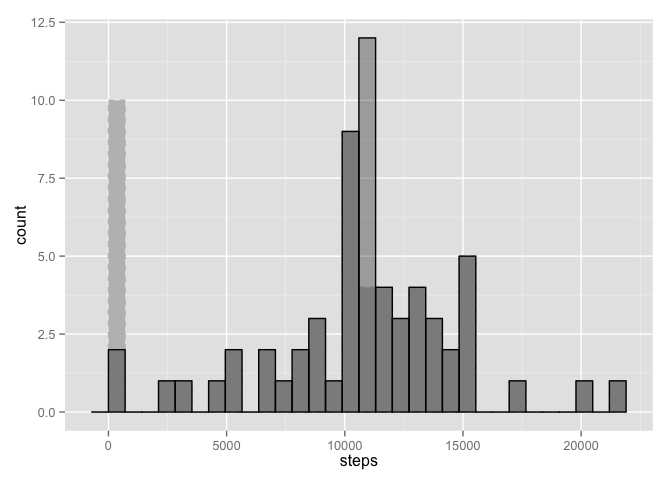
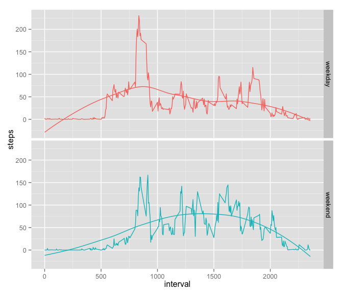

# Reproducible Research: Peer Assessment 1
Federico Calore  
7 Nov 2015  

## Introduction
> Data from a personal activity monitoring device. This device collects data at 5 minute intervals through out the day. The data consists of two months of data from an anonymous individual collected during the months of October and November, 2012 and include the number of steps taken in 5 minute intervals each day.

## Loading and preprocessing the data

### Load the data

After checking existence of the files,

1. download,
2. unzip and
3. load the data in memory as dataframe


```r
file <-
  "https://d396qusza40orc.cloudfront.net/repdata%2Fdata%2Factivity.zip"
dest <- "repdata_data_activity.zip"

# check for zip file existence and skip download in case
if (!file.exists(dest)) {
  download.file(file, dest, method = "curl")
  today <- as.character(Sys.time())
  print(paste("File downloaded on", today)) # print date and time of download
}
```

```
## [1] "File downloaded on 2015-11-14 12:23:55"
```

```r
content <- unzip(dest, list = TRUE) # reads the list of files in the zip
# check for existence of extracts, and skip unzipping in case
if (!file.exists(content$Name)) {
  unzip(dest)
}
activity <- read.csv(content$Name) # loads csv data into dataframe
str(activity) # print summary
```

```
## 'data.frame':	17568 obs. of  3 variables:
##  $ steps   : int  NA NA NA NA NA NA NA NA NA NA ...
##  $ date    : Factor w/ 61 levels "2012-10-01","2012-10-02",..: 1 1 1 1 1 1 1 1 1 1 ...
##  $ interval: int  0 5 10 15 20 25 30 35 40 45 ...
```

\newpage

## What is the mean total number of steps taken per day?

1. *Calculate the total number of steps taken per day and make a histogram.*


```r
# need to specify to ignore NAs values with na.rm = TRUE,
daily_steps <-
  data.frame(
    # tapply sum of steps for each date
    steps = tapply(activity$steps,
                   activity$date,
                   FUN = sum,
                   na.rm = TRUE)
  )

library(ggplot2)
ggplot(daily_steps, aes(steps)) +
  geom_histogram() # build histogram of daily steps
```

 

2. *Calculate and report the mean and median of the total number of steps taken per day.*


```r
data.frame(
  mean = mean(daily_steps$steps),
  median = median(daily_steps$steps)
)
```

```
##      mean median
## 1 9354.23  10395
```

\newpage

## What is the average daily activity pattern?

1. *Make a time series plot of the 5-minute interval (x-axis) and the average number of steps taken, averaged across all days (y-axis).*


```r
mean_steps <-
  data.frame(
    # tapply mean of steps for each interval value
    interval = unique(activity$interval),
    steps = tapply(activity$steps, activity$interval, FUN = mean, na.rm = TRUE)
  )
```

2. *Which 5-minute interval, on average across all the days in the dataset, contains the maximum number of steps?*


```r
# display interval for which number of steps is the max
maxsteps <-
  mean_steps[which(
    mean_steps$steps == max(mean_steps$steps, na.rm = TRUE)),
    ]
maxsteps
```

```
##     interval    steps
## 835      835 206.1698
```

```r
# build line plot with the average number of steps
# for each interval and highlight the max
ggplot(mean_steps, aes(x = interval, y = steps)) +
  geom_line() +
  geom_vline(xintercept = maxsteps$interval, colour="red", linetype = "longdash")
```

 

\newpage

## Imputing missing values

1. *Calculate and report the total number of missing values in the dataset.*


```r
NAvalues <- is.na(activity$steps) # is.na returns booleans
sum(NAvalues) # sums the TRUEs (value 1)
```

```
## [1] 2304
```

2. *Devise a strategy for filling in all of the missing values in the dataset. The strategy does not need to be sophisticated. For example, you could use the mean/median for that day, or the mean for that 5-minute interval, etc.*


```r
# build a new data frame with average steps for each interval
activity_mean <- merge(activity[, 2:3], mean_steps)
activity_mean <- activity_mean[with(activity_mean, order(date, interval)), ]
```

3. *Create a new dataset that is equal to the original dataset but with the missing data filled in.*


```r
# create a new df by copying the original and then filling the NAs with average values
activity_fill <- activity
activity_fill$flag <-
  ifelse(NAvalues,
         "input", "original") # add flag column, original or input
activity_fill[NAvalues, "steps"] <-
  activity_mean[NAvalues, "steps"] # overwrite NAs
```

3. *Make a histogram of the total number of steps taken each day.*


```r
daily_steps_fill <-
  data.frame(
    # tapply sum of steps for each date
    steps = tapply(activity_fill$steps,
                   activity_fill$date,
                   FUN = sum)
  )

# new histogram of daily steps with inputed values
ggplot(daily_steps_fill, aes(steps)) +
  geom_histogram()
```

 

4. *Calculate and report the mean and median total number of steps taken per day.*


```r
# compare original mean and median vs with imputed values
data.frame(
  df = c("original", "imputed"),
  mean = c(
    mean(daily_steps$steps, na.rm = TRUE),
    mean(daily_steps_fill$steps)),
  median = c(
    median(daily_steps$steps, na.rm = TRUE),
    median(daily_steps_fill$steps))
)
```

```
##         df     mean   median
## 1 original  9354.23 10395.00
## 2  imputed 10766.19 10766.19
```

5. *Do these values differ from the estimates from the first part of the assignment? What is the impact of imputing missing data on the estimates of the total daily number of steps?*

Inputing missing values raised both mean and median values.  
**Note**: if we didn't ignore the NAs from the initial *sum* calculation, mean and median would be unaffected by imputting, because we would have removed the incomplete days from the start.

\newpage

## Are there differences in activity patterns between weekdays and weekends?

1. *Create a new factor variable in the dataset with two levels – “weekday” and “weekend” indicating whether a given date is a weekday or weekend day.*


```r
daynames <- c("Monday", "Tuesday", "Wednesday", "Thursday", "Friday")
activity_fill$day <-
  # check whether the date is a weekday and fills factor variable accordingly
  factor(
    ifelse(weekdays(as.Date(activity_fill$date)) %in% daynames,
           "weekday", "weekend")
  )
```

2. *Make a panel plot containing a time series plot of the 5-minute interval (x-axis) and the average number of steps taken, averaged across all weekday days or weekend days (y-axis).*


```r
# build df for mean steps of weekdays only
activity_fill_weekday <- subset(activity_fill, day == "weekday")
mean_steps_weekday <-
  data.frame(
    day = "weekday",
    interval = unique(activity$interval),
    steps = tapply(activity_fill_weekday$steps,
                   activity_fill_weekday$interval,
                   FUN = mean, na.rm = TRUE)
  )

# build df for mean steps of weekends only
activity_fill_weekend <- subset(activity_fill, day == "weekend")
mean_steps_weekend <-
  data.frame(
    day = "weekend",
    interval = unique(activity$interval),
    steps = tapply(activity_fill_weekend$steps,
                   activity_fill_weekend$interval,
                   FUN = mean, na.rm = TRUE)
  )

# merge the two df
mean_steps_days <-
  rbind(
    mean_steps_weekday,
    mean_steps_weekend
  )
```

\newpage

The activity during the weekends is more distributed during the entire day, while through the working week the activity looks bimodal, more concentrated in the morning (sport activity?) and evening (commuting?).


```r
# panel plot faceted by day type
ggplot(mean_steps_days, aes(x = interval, y = steps, colour = factor(day))) +
  geom_line() +
  geom_smooth(se = FALSE) + # add smoother to help visualize distribution shape
  facet_grid(day ~ .) +
  guides(colour=FALSE)
```

 
